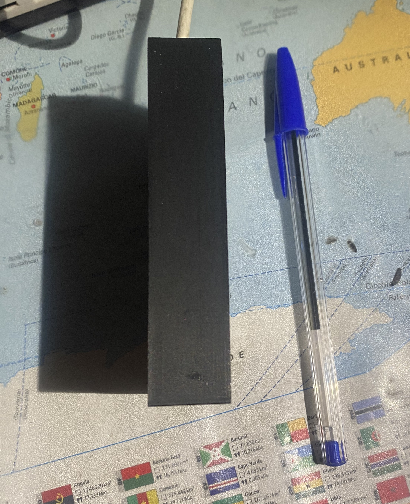

# 📌 SpotifyDisplay

## 📖 Description
This project uses an **ESP32** connected to an **ILI9341 display**, allowing real-time display of various information about the song currently playing on Spotify.

## 🛠️ Hardware Used
- **ESP32**
- **ILI9341 display with touchscreen**

## 📦 Dependencies
To compile the project, the following libraries are required:

```
XPT2046_Touchscreen
Adafruit_ILI9341
Arduino_JSON
HTTPClient
JPEGDEC
base64
WiFi
```

## 🔧 Installation
1. Connect the components following the schematic below:
   
2. Clone the repository:
   ```bash
   git clone https://github.com/filipporaciti/SpotifyDisplay.git
   ```
3. Before uploading the project, we need to calculate the calibration values for the touchscreen:
* Open the project in the `displayCalibration` folder
* Upload the project to the ESP32
* Touch the red square and note down the x and y values displayed on the screen
* Touch the yellow square and note down the x and y values displayed on the screen
4. Open the project in the `SpotifyDisplay` folder
5. Change the TS_MINX value with the x value from the red square, TS_MINY with the y value from the red square, TS_MAXX with the x value from the yellow square, TS_MAXY with the y value from the yellow square
6. Rename the `secrets.h.example` file to `secrets.h` and modify it with the correct values (for ACCESS_TOKEN and REFRESH_TOKEN, use the [get_spotify_token.py](./get_spotify_token.py) script)
7. Upload the code to the ESP32
8. (Optional) The files to 3D print the case are located in the `case_spotify_display` folder

## 🚀 Features 
The firmware allows you to:
* Display the name of the song, artist, and album image currently playing
* Play, pause, skip forward, or go back through the song using the touchscreen
* You can set up to two Wi-Fi networks to connect the ESP32 to the internet

## ❌ Known Issues
* The artist and song names get cut off when they reach the edge of the display (see demo image)
* Sometimes the image may not display (this happened to me only once)

## 📸 Screenshot/Demo
* Currently playing song on Spotify


* Display calibration firmware


* Side of the case




* Back of the case

